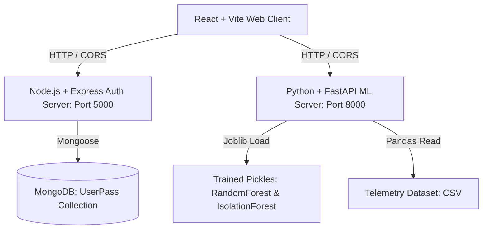

# 🏭 FactoryPulse AI — Smart Manufacturing Analytics & Predictive Maintenance

FactoryPulse AI is an advanced, full-stack industrial IoT telemetry dashboard and predictive analytics platform. It enables real-time factory monitoring, machine failure prediction, anomaly detection, and interactive AI-driven decision support.

---

## 🏗️ System Architecture & Technology Stack

The application runs a multi-tier architecture to separate user management, data visualization, and machine learning computation:



### 1. Frontend Web Client (React + Vite)
*   **Core Tech**: React 19, React Router (v7), Vite, and Lucide React.
*   **Visual Analytics**: Interactive data visualization using Recharts (Line, Bar, Pie, and Area trends).
*   **Theme Engine**: Built-in glassmorphism-styled Dark/Light mode toggle.
*   **AI Integration**: Drag-and-drop CSV parser (via Papaparse) and interactive chat interface connected to the ML microservice.

### 2. Authentication & User Database (Node.js + Express)
*   **Core Tech**: Express.js server running on port `5000`.
*   **Database**: MongoDB (connecting via Mongoose to `mongodb://127.0.0.1:27017/User`).
*   **Security**: Password hashing via Bcrypt.js.
*   **Endpoints**:
    *   `POST /api/register` - Registers factory users, validating unique emails and phone contacts.
    *   `POST /api/login` - Authenticates users via email or contact number, returning secure profile objects.

### 3. Machine Learning & Telemetry Engine (Python)
*   **Core Tech**: Scikit-Learn, Pandas, NumPy, Joblib, Seaborn, and Matplotlib.
*   **Model Architectures**:
    *   *Random Forest Classifier*: Used to predict machine failures (e.g. Tool Wear, Heat Dissipation, Power, and Overstrain failures).
    *   *Isolation Forest*: Unsupervised anomaly detector for spotting irregular telemetry deviations.
*   **FastAPI API**: Expected to run on port `8000` to serve real-time predictions, CSV processing, and assistant chat requests.

---

## 🔮 Machine Learning Model & Preprocessing

The ML pipeline is defined in [train_model.py](file:///c:/Users/sahas/OneDrive/Desktop/factory_full%20project/Demo-Factory-Pulse/train_model.py) and processes the default dataset of **10,000 machine telemetry records** (which includes a baseline $3.39\%$ failure rate).

### ⚙️ Feature Engineering
Before training, the raw dataset is enriched with physics-based features:
1.  **Machine Type Encoding**: Labels are encoded ($L \to 1$, $M \to 2$, $H \to 0$).
2.  **Temperature Delta ($\Delta T$)**: 
    $$\Delta T = T_{\text{process}} - T_{\text{air}}$$
    *Low temperature delta indicates poor heat dissipation, a major driver of machinery failure.*
3.  **Power Draw ($P$)**:
    $$P = \tau \times \omega$$
    *Power is calculated as the product of Torque ($\tau$ in Nm) and Rotational Speed ($\omega$ in rpm) to detect overstrain conditions.*

### 📊 Model Evaluation Summary
The Random Forest Classifier is trained using class weights to balance the minority failure class:

| Metric | Score / Result | Details |
| :--- | :--- | :--- |
| **Dataset Size** | 10,000 rows | 80/20 Stratified Train/Test Split |
| **Accuracy** | **$98.95\%$** | Overall accuracy on test set |
| **Precision** | **$86.15\%$** | Out of predicted failures, percentage that are actual failures |
| **Recall (Sensitivity)**| **$82.35\%$** | Percentage of real failures successfully flagged |
| **F1-Score** | **$0.8421$** | Balanced harmonic mean of precision and recall |
| **ROC-AUC** | **$0.9675$** | Model's true positive vs. false positive rate curve |
| **5-Fold Cross-Val F1**| **$0.821 \pm 0.030$**| Cross-validation stability check |

#### 🔍 Isolation Forest Anomalies
*   **Contamination Rate**: $4.0\%$ (expects $\approx 400$ anomalies out of 10,000 rows).
*   **Actual Failure Overlap**: Out of the $400$ anomalies detected, **$89$ are actual machine failures**, meaning the unsupervised detector successfully highlights $26.3\%$ of failures without using any training labels.

---

## 📁 Project Directory Structure

```text
Demo-Factory-Pulse/
├── data/
│   └── ai4i2020_final_updated_dataset.csv  # 10k raw machine telemetry records
├── models/                                 # Generated after running train_model.py
│   ├── failure_model.pkl                   # Trained Random Forest classifier
│   ├── iso_forest.pkl                      # Trained Isolation Forest anomaly model
│   ├── scaler.pkl                          # Standard scaler object for telemetry
│   ├── label_encoder.pkl                   # Category encoder for machine Type
│   └── evaluation_charts.png               # Saved Confusion Matrix, ROC curve & feature importances
├── public/                                 # Assets, logos, and favicons
├── src/                                    # Active React Frontend
│   ├── assets/                             # Local UI styles and icons
│   ├── pages/                              # Core dashboard views
│   │   ├── Home.jsx                        # Portal landing page
│   │   ├── Login.jsx                       # Authentication page
│   │   ├── Register.jsx                    # User registration page
│   │   ├── Dashboard.jsx                   # Central analytics interface
│   │   ├── Machine.jsx                     # Machine telemetry status and upload
│   │   ├── Prediction.jsx                  # ML Confidence charts & heatmaps
│   │   ├── AIAssistant.jsx                 # AI Chatbot & telemetry drop-zone
│   │   ├── Report.jsx                      # PDF & CSV reporting logs
│   │   ├── About.jsx                       # Platform information
│   │   └── SettingsPage.jsx                # Threshold & profile manager
│   ├── App.jsx                             # Route definitions & protected route wrapper
│   └── main.jsx                            # React entrypoint
├── server.js                               # Node.js/Express User Auth backend
├── train_model.py                          # ML model training and visualization script
├── requirements.txt                        # Python ML and backend requirements
├── package.json                            # React Frontend + Express dependencies
└── vite.config.js                          # Vite configuration
```

---

## 🚀 Getting Started

### 1. Prerequisites
Ensure you have the following installed on your local environment:
*   [Node.js](https://nodejs.org/) (v16 or higher)
*   [Python](https://www.python.org/) (v3.9 or higher)
*   [MongoDB Community Server](https://www.mongodb.com/try/download/community) (running locally on port `27017`)

---

### 2. Setup the User Database (MongoDB)
Make sure your MongoDB server is active. Mongoose will automatically create the `User` database and the `UserPass` collection on your first registration request.
```bash
# Verify MongoDB is running (Windows Command Prompt)
net start MongoDB
```

---

### 3. Install & Start User Auth Server (Node.js)
Install Node modules from the root `Demo-Factory-Pulse/` directory and run the Express API:
```bash
# Navigate into the project folder
cd Demo-Factory-Pulse

# Install project dependencies
npm install

# Start the authentication backend (listens on port 5000)
node server.js
# Or with automatic reload (if nodemon is preferred)
npx nodemon server.js
```

---

### 4. Train the ML Models & Setup Python Backend
Create a virtual environment, install Python requirements, train the models, and run the FastAPI server:

```bash
# Create a virtual environment
python -m venv venv

# Activate the virtual environment
# On Windows:
venv\Scripts\activate
# On macOS/Linux:
source venv/bin/activate

# Install Python ML and backend requirements
pip install -r requirements.txt

# Run the model training pipeline
python train_model.py
```
> [!NOTE]
> Running `train_model.py` generates the `models/` folder containing the model binaries (`.pkl` pickles) and saves evaluation charts to `models/evaluation_charts.png`.

#### Run the FastAPI Service
Launch the Python FastAPI microservice on port `8000`:
```bash
# Run FastAPI server (typically defined as backend/main.py or similar entrypoint)
uvicorn backend.main:app --port 8000 --reload
```

---

### 5. Launch the Frontend Application
In a new terminal window, start the React dev server using Vite:
```bash
# Make sure you are in Demo-Factory-Pulse
npm run dev
```
Open your browser and navigate to `http://localhost:5173` (or the port specified by Vite) to view the portal.
